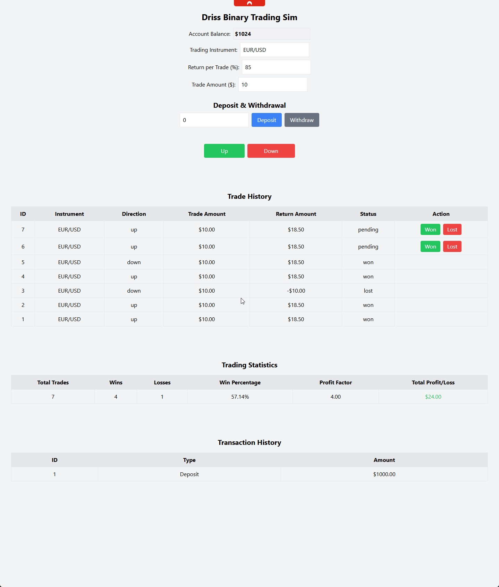

# Driss Binary Trading Sim

## Overview
Driss Binary Trading Sim is a simple **binary options trading simulation app** built with **React and Tailwind CSS**. It allows users to place trades, manage their balance, and track trade history, statistics, and transactions.



## Features
### 🎯 **Sim Trading System**
- **Trade Up/Down:** Predict market movement and place trades.
- **Set Return Percentage:** Customize trade returns (default: 85%).
- **Select Trade Amount:** Choose the amount per trade.
- **Trading Instrument Selection:** Trade assets like `EUR/USD`.
- **Win/Loss Update:** Set the outcome of trades manually.
- **Profit/Loss Calculation:** Updates balance based on trade results.
- **Prevention of Over-Trading:** Trade only if the balance is sufficient.

### 💰 **Balance & Transactions**
- **Deposit & Withdraw Funds:** Manage your account balance.
- **Transaction History:** Keep track of deposits and withdrawals.

### 📊 **Trade Tracking & Statistics**
- **Trade History:** View past trades with all details.
- **Statistics Table:** Displays:
  - Total trades
  - Wins & losses
  - Win percentage
  - Profit factor
  - Total profit/loss (color-coded for clarity).

## 🚀 **How to Run the App**
### 1️⃣ Clone the Repository
```sh
 git clone https://github.com/your-username/binary-trading-sim.git
 cd binary-trading-sim
```
### 2️⃣ Install Dependencies
```sh
 npm install
```
### 3️⃣ Start the Application
```sh
 npm start
```
This will open the app at `http://localhost:3000/` in your browser.

## 🛠 **Technology Stack**
- **React** – UI development
- **Tailwind CSS** – Styling
- **JavaScript (ES6+)** – Logic and state management

## 📷 **Screenshots**
_Include screenshots of the app here_

## 🤝 **Contributing**
Want to improve this project? Feel free to fork and submit a pull request!

## 📜 **License**
This project is **MIT Licensed**. You are free to modify and use it as you like!

---
**Created by Driss** 🚀

